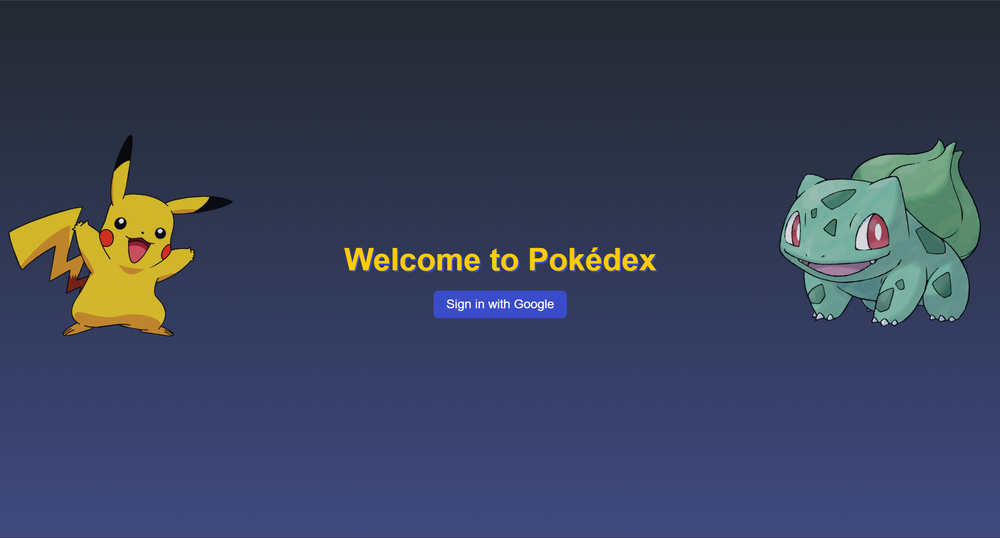
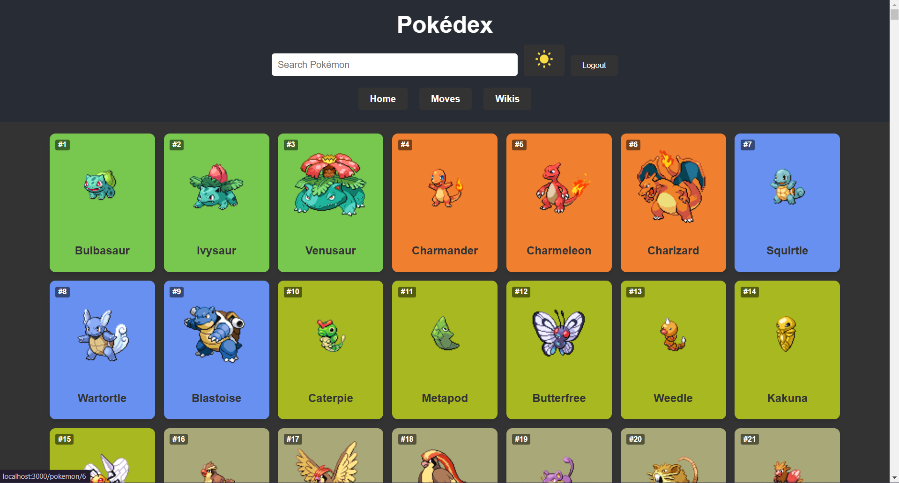
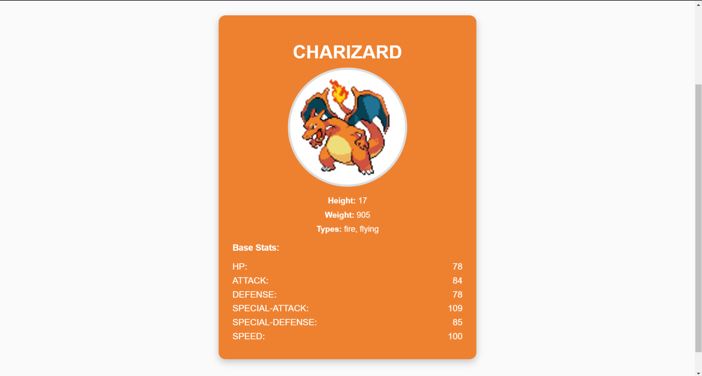
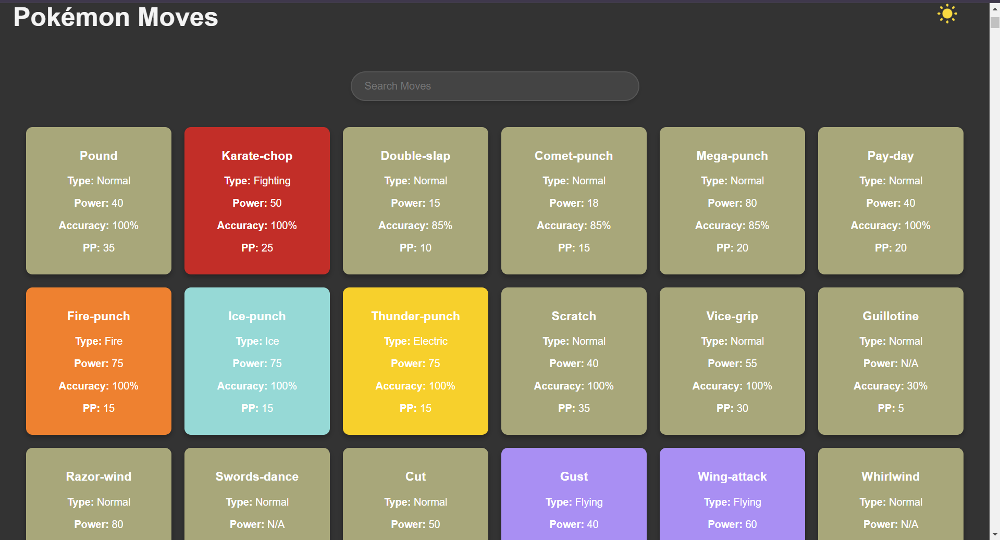
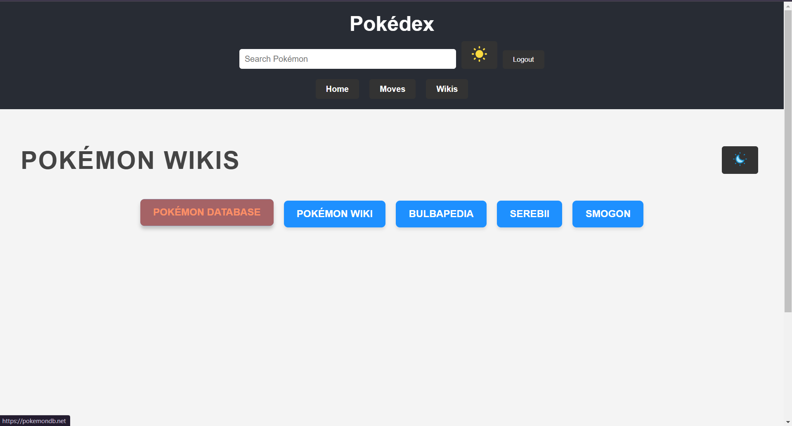

# Pokedex Project

A Pokedex application that allows users to explore Pokémon data using the [POKEAPI](https://pokeapi.co/). This project was created as part of the WebDev2 course to showcase understanding in React, API integration, and user interface design. 

## Author
**Malek Mansour**

---

## 🌟 Features

### 🔍 Pokémon Explorer
- **View All Pokémon**: Browse through a comprehensive list of Pokémon.
- **Search by Name**: Quickly find Pokémon by entering their names.
- **View Pokémon Details**: Access detailed information for each Pokémon, including stats, abilities, and more.

### 🌀 Moves Explorer
- **View All Moves**: Browse and explore detailed information about Pokémon moves.
- **Search Moves**: Find moves by name using a search bar.
- **Move Details**: View key move stats, including type, power, accuracy, and PP.

### 📖 Pokémon Wikis
- **Curated List of Wikis**: Quick access to the most popular Pokémon wikis, including:
  - [Pokémon Database](https://pokemondb.net/)
  - [Pokémon Wiki](https://pokemon.fandom.com/)
  - [Bulbapedia](https://bulbapedia.bulbagarden.net/)
  - [Serebii](https://www.serebii.net/)
  - [Smogon](https://www.smogon.com/)

### 🔐 User Authentication
- **Sign In with Google**: Log in securely using your Google account.

### 🌙 Light/Dark Mode
- Switch between Light Mode and Dark Mode for a personalized browsing experience.

---

## 🛠️ Tech Stack

- **Frontend**: React.js
- **API**: [POKEAPI](https://pokeapi.co/)
- **Authentication**: Firebase Authentication with Google Sign-In
- **Styling**: CSS 
- **Icons**: Custom icons for toggling Light/Dark Mode

---

## 🖼️ Screenshots

### 1. Login Page

### 2. Pokémon List

### 3. Pokémon Details

### 4. Move Explorer

### 5. Wikis

---